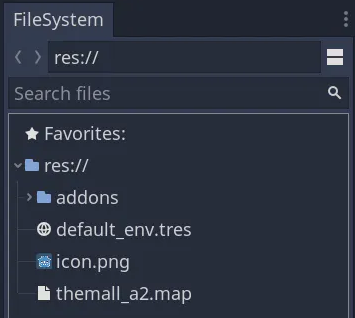

# Building Maps

Assuming your map fits the list of supported .map formats, and has limited entities, this is the fastest way to get your map into Godot.

- Add a .map file to your Godot project directory.

- Load it up from a QodotMap node.

- Hit Full Build in the toolbar.

Your map is now in Godot!

Note
{: .label .label-blue }
If you don’t see QodotMap in your nodes list, make sure you have enabled Qodot in the Project → Project Settings -> Plugin window.

If you want to display textures on your map geometry, read [Loading Textures in Trenchbroom](loading-textures.md).

If you don't have an original map, and you're trying to port a map instead, read the page on [Porting](../porting.md).

# Troubleshooting

If your map isn't building, one of the following is probably the case:

- Somewhere in your filepath, there is a space(probably in texture names).
- Somewhere in your filepath you are using UTF-8 characters
- You are using different filetypes for your textures that aren't listed as allowed. Go into the QodotMap node, under the section Textures, make sure the field "Texture File Extensions" includes the file extensions for your texture. Not all texture file formats will work, as this is dependent upon what texture files Godot can use, though tga, png and jpeg should all work.
