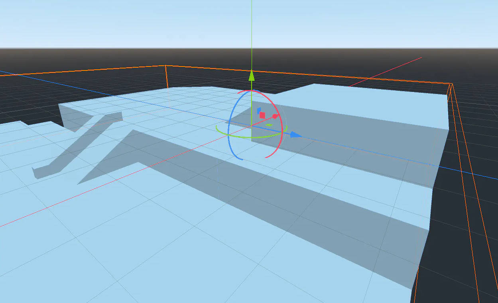

# Building Maps

Assuming your map fits the list of supported .map formats, and has limited entities, this is the fastest way to get your map into Godot.

- Add a .map file to your Godot project directory.

- Load it up from a QodotMap node.

- Hit Full Build in the toolbar.

Your map is now in Godot!

Note
{: .label .label-blue }
If you don’t see QodotMap in your nodes list, make sure you have enabled Qodot in the Project → Project Settings -> Plugin window.

If you want to display textures on your map geometry, you'll need to connect your Godot project to Trenchbroom with a .cfg, as shown in the [Applying Textures](applying-textures.md).

If you don't have an original map, and you're trying to port a map instead, read the page on [Porting](../porting.md).
