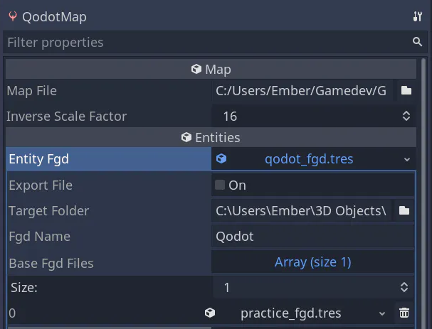
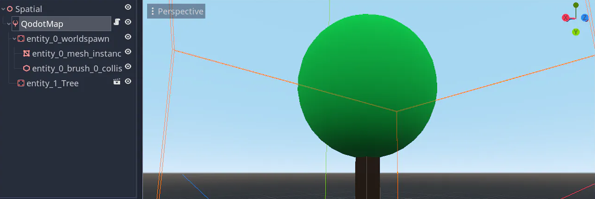
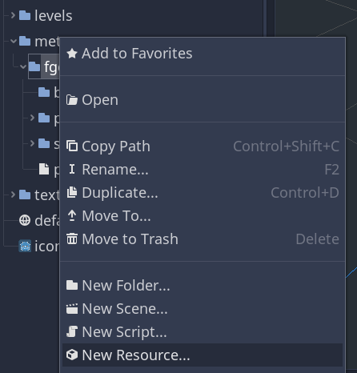
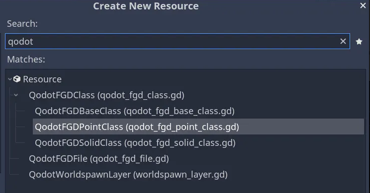
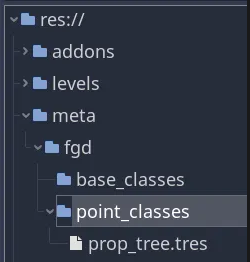
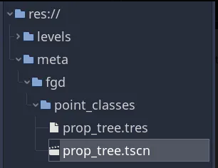
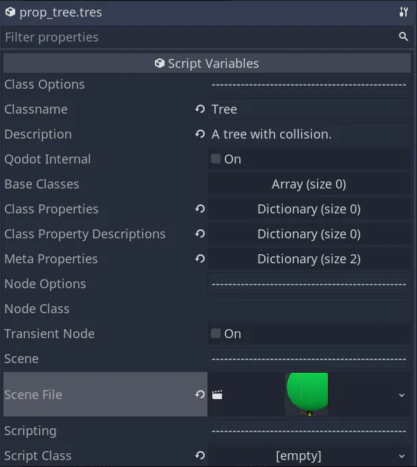
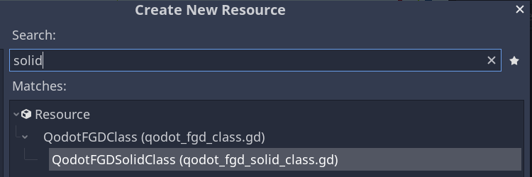
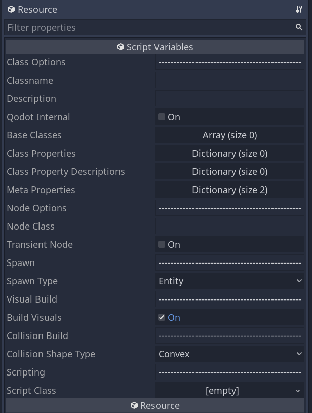
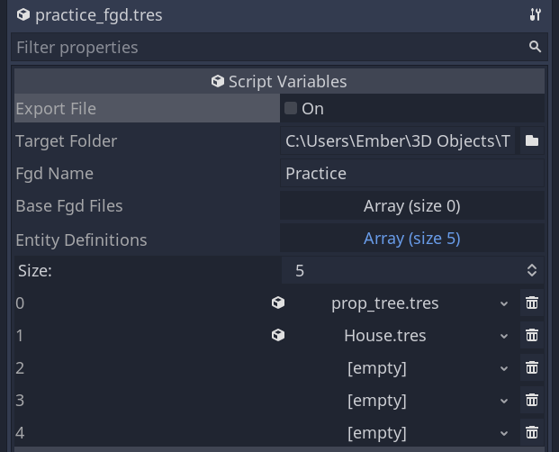

# Entities
Entities tie Godot functionality to 3D positions and specially-marked brushes in your map file.

This guide covers how to add entities to your Trenchbroom game config, and how to add Godot functionality to those entities.

1. TOC
{:toc}

## Introduction to Entity Types

There are three main types of entities:
- Point Classes
- Solid Classes
- Base Classes

A point entity is a position in 3D space. They work well for spawn locations, pickups, and instancing Godot scenes.

Solid classes are pieces of geometry with special properties, like doors and breakable walls. You can use these entities to tie scripts and other functionality to brushes in the world. Collision and meshes are optional as well.

Base classes are empty; they only contain properties as a template for other classes. They're handy when needed, but never required.

Keep in mind that "Entities" and "Classes" mean the same thing for this entire page. Qodot calls them classes, Trenchbroom calls them entities. Neither of these systems inherently interact with the classes found in GDscript or C#, they are completely separate.

# Creating an FGD file

This should be your first step before adding any entities for a brand new Godot project.

FGD fles (Forge Game Data) hold definitions for entities. They are required to make Trenchbroom and QodotMap understand custom entities.

While you can piggyback off of Qodot.fgd included in all installations of Qodot, this puts your custom entities at risk if you choose to update Qodot, since Qodot.fgd will be overwritten with the defaults.

It is safer to create a unique FGD file for your game that goes with the custom Trenchbroom game config created earlier in the [Applying Textures](./beginner's-guide-to-qodot/applying-textures) guide.

Right-click on the Filesystem dock and click Create New Resource. Make a QodotFGDFile:


I recommend saving this file as your_game_name_fgd.tres so it’s easy to search for “fgd” or just your game’s name the Filesystem dock. Mine is practice_fgd.tres.

Change the _Fgd Name_ to your game’s name.

Note
{: .label .label-blue }
You have to set the Fgd Name so it doesn’t conflict with the “Qodot” namespace, otherwise Trenchbroom will discard your FGD.

FGDs by default contain example entity definitions, which we don't need as Qodot.fgd contains all of these already. It helps to start an FGD with a completely clean entity definitions array, so you can focus on adding new entities not covered by Qodot.fgd.

## Adding an Entity Definition to an FGD

With your FGD open, click on the Entity Definitions array to open it. Drop your new entity definition into any empty slot in the list.


We still need to update the Trenchbroom game config to include our new entity definitions. Later we'll make sure the QodotMap node catches wind of the new entity definitions.

## Adding required Entity Definitions to your FGD

Before trying to consider your FGD complete, you may want to include worldspawn layer and group functionality in your FGD. These are kept as classes in Qodot.fgd, and are recommended to copy-over into all custom FGDs.

These entities are:

- worldspawn_solid
- worldspawn_base
- group_solid

You can expect them to work out of the box and not require changing, so they can be left in the `/addons/qodot` folder and updated as needed.

## Adding FGDs to your Trenchbroom game config
Open the `config_folder.tres` resource and add a new item to the _Fgd Files_ array. Add the FGD you made by dragging and dropping, or by using the folder selection button.


Note
{: .label .label-blue }
Make sure to save your FGD resource first by clicking the save icon in the top right, or by pressing Ctrl + S with any scene open.

Click _Export File_ again.

Now you can open Trenchbroom, or go to File → Refresh Entity Definitions if you already have it open.

Note
{: .label .label-blue }
If you get a Trenchbroom error about incomplete strings, make sure the *Fgd Name* on your own FGD is not “Qodot”.

Note
{: .label .label-blue }
An error can occur if any entity definitions are missing a classname.


You should be able to see more entity definitions in the entity collections list. This means your FGD made it into Trenchbroom successfully!


If you already have entities in your FGD, switching to your FGD should show your list of entities in the entity browser.


## Adding FGDs to a QodotMap
This final step only applies when setting up a new QodotMap in a Godot scene.
 
In your QodotMap node, open the _Entity Fgd_ array_._ Although it’s taken by Qodot.fgd by default, you can replace it with your own FGD file.

Alternatively, you can open Qodot.fgd's _Base Fgd Files_ array and add your FGD there. Either works fine. Here's an example of me doing the latter:


Build the map, your point entity should show up!



Once you've added your FGD to a QodotMap once, that QodotMap will update its entity definitions with your FGD resource.

## Updating your FGD

When you end up making more entities and need to update your FGD, here's what needs doing:

1. Add entity definitions to your FGD
2. Save your FGD resource
3. Open `config_folder.tres` and check that sure your FGD is on the FGD list.
4. Click Export File in the Inspector
5. Press <kbd>F6</kbd> in Trenchbroom

Your new entity definition should show up.

# Creating new Entities

In Qodot, you define new types of entities by creating a new .tres resource file. Qodot provides 3 resource presets for this:

- QodotFGDPointClass
- QodotFGDSolidClass
- QodotFGDBaseClass

Click the "New Resource" icon in the Inspector:


Or right-click the FileSystem and click "Create New Resource":



Either will take you to the resource search screen. Here you can type in the following quick terms to narrow down the type of resource you want to create:

- pointclass
- solidclass
- baseclass

What follows is a breakdown of each property in the Inspector when editing one of the three main class types.

## Base Class Properties

These properties are shared by Point and Solid classes. Base Class only exists as a template for other classes, if you're looking for an ECS-like approach to sharing properties.

**Classname** - The name for this class in Trenchbroom.

**Description** - A short description that displays in Trenchbroom when this entity is selected.

**Qodot Internal** - Hides the entity in Trenchbroom's entity browser.

Qodot can still refer to this entity for building other entities (like base entities). Base Entities are already hidden in Trenchbroom by default, for most situations you can leave this off.

**Base Classes** - An array of template entities to inherit properties from.

This determines the parent entities for this class, where this entity gets all the class properties, meta properties, and property descriptions from its parents.

**Class Properties** - A dictionary of properties.

Once exported to the Trenchbroom game config, the dictionary values are written by editing entities in Trenchbroom, and read by accessing `properties` on a QodotEntity once the map is built.

To add a new class property to an entity:

1. Open the dictionary.
2. Click the first pencil by "New Key: [null]" and select "String" as the key data type.
3. Name your property in the key text field, no spaces.
4. Click the second pencil by "New Value: [null]".
5. Select any valid data type. Read [Class Property Data Types](#class-property-data-types) for more information.
6. Change the value to your desired default, or leave it blank.
7. Click "Add new key/value pair".
8. Re-export your FGD once all class properties are added.

You can also set default values for your properties, by repeating this process in Meta Properties, matching the key names and value datatypes from this dictionary.

**Class Property Descriptions** - A dictionary of descriptions for each property, visible in Trenchbroom.

Follow the same steps as adding class properties to add property descriptions. Ensure the description's key matches the property's key. Description values can only be strings.

**Meta Properties** - Editor-specific properties, such as the default color and size used to represent this class.

Add an entry with a matching key to an existing property, set the value to the same data type, and whatever value is present will become the default. Only one meta property is read per class property.

**Node Class** - The type of Godot node to spawn at this location.

This doesn't fully control the type of node that Godot spawns, read on to learn more about using Node Class with Point Classes and Solid Classes.

## Point Class properties

Point Classes inherit all features from Base Classes, with a few additions. QodotMap reads their position in the map, and places a QodotEntity node in their place. You have the option to replace the QodotEntity node with other node types, or even instance .tscn scenes in their place.

**Scene File** - The .tscn Godot scene that spawns in place of QodotEntity. The easiest way to spawn a specific node at a specific point.

Scene File takes priority over every other option here, especially if there's already a script attached to the .tscn file.

**Script Class** - The script to attach to your entity's root node.

This is ideal for spawning nodes without a .tscn file. If you want to access this entities' Class Properties, add a script here that `extends QodotMap` and accesses `properties["key_name"]`.

You can extend other Spatial-derived node types too, and add necessary children (CollisionShape, MeshInstance) through code, but you lose out on the ablity to access `properties`. You can fix this by always choosing to extend `QodotEntity` and adding more complex nodes like Area and RigidBody as children through code.

Make sure to update Node Class so it matches the the script's `extends`!

**Node Class** - The type of node to spawn at this location. This property should match the `extends` of your Script Class. You can ignore this property if you're using a Scene File.

With those properties covered, there's a few tricks you can use to get more specific results.

If you want to create an RigidBody node without a .tscn using a point entity, extending `RigidBody` in thes script prevents you from accessing the class property values set in Trenchbroom. However, extending `QodotEntity` prevents you from accessing the functions and signals of a RigidBody.

You can get around this by extending `QodotEntity` and using `var body = RigidBody.new()` and `add_child(body)` to add more complex nodes as children, while still having access to the `properties` dictionary. This can be repeated for other children like MeshInstance and CollisionShape.

## Solid Class Properties

Solid classes can have multiple brushes, so these properties apply to the solid class as a single object, not to each brush individually.

**Spawn Type** - Changes how the QodotMap arranges these brushes in its node hierarchy.

There are 4 settings:
- Worldspawn
- Merge Worldspawn
- Entity
- Group

**Build Visuals** - Makes the solid class visible when checked.

You may want to disable this for invisible triggers and other gameplay-related solid classes.

**Node Class** - Sets the node type of the solid class root.

If you're adding a Script Class, this value should match the `extends` of the script.

Setting this to RigidBody and setting Spawn Type to Entity changes these brushes from static geometry into physics objects.

**Collision Shape Type** - Changes how collision is built.

- None
- Convex
- Concave

Convex creations a CollisionShape for each brush, depending on the Spawn Type. Entity creates an outer hull, Group creates individual shapes for each brush. Convex is a good bet for most situations.

Concave allows for concave brush geometry, or if you chose Entity and want a single concave CollisionShape to make up your solid class. 🚧

**Script Class** - The script applied to the entity's root.

Although `QodotFGDSolidClass` is a class you can extend from, this is meant as a Qodot internal to build solid classes. This does not extend QodotEntity, and will not give you access to `properties`.


# Class Property Data Types

As shown earlier in this page, you can define properties for entities in the Class Properties dictionary. The "key" for each dictionary entry should be a String. The "value" can only be one of these 8 data types:

- Bool
- Int
- Float
- String
- Vector3
	- Stored as a string in the form X Y Z
- Color
	- Stored as a string in the form R G B
- Dictionary
	- Used for defining a set of choice key strings and their associated values
	- Will display a dropdown in compatible editors
	- Available Dictionary value types haven't been thoroughly tested
- Array
	- Used for bitmask flag properties
	- Will display a grid of checkboxes in Trenchbroom
	- Used in Quake to indicate which entities spawn on different difficulties - easy, medium, hard
	- Each entry in the array should be an array, with three elements: `[name: String, value: bool/float/int/String, default: same type as value]`

## Note on Arrays

When you add an Array as a class property, it must contain other Arrays, with each Array creating one flag. These flag Arrays must have 3 items: Name, Value, and Default value.

Name must be a String.

Value is traditionally a bool, but it can also be a float, int, or String. Qodot parses all these data types as Strings in the end, which will change how you will be [Accessing Class Properties in Code](#accessing-class-properties-in-code).

The default value can be the previous data type, or even `null`. It is not read by Qodot, just the regular Value.

# Accessing Class Properties in Code

To access class properties in code, ensure your entity `extends QodotEntity`, then access its `properties` variable.

The `properties` dictionary will feature the same keys you set earlier in Class Properties. The value data types will also match, but their contents will be changed to match what you set in your map file.

For example, setting the `"respawn_time"` of a pickup entity to 60 seconds will return 60 when accessing `properties["respawn_time"]` in code.

For safety, you can check for these properties using `if "key_name" in properties:` and *then* access them with `properties["key_name"]`.

## Full example

If you have a point light entity with a "color" key and a Color value in the class properties, your code could look like this to apply the color to your light:

```gdscript
extends QodotEntity

# This variable is static-typed so I get code autocomplete.
# I want to code like it already exists, even though it's created at runtime.
var light: OmniLight

func _ready:
	light = OmniLight.new()
	add_child(light)
	# Optional step: prevent errors if the property doesn't exist.
	if "color" in properties:
		# Assign the value read from the map file to this node's property
		light.light_color = properties["color"]

```

In general, instance complex nodes in code, so you don't lose access to the properties dictionary. You can do this for .tscn files too if they have no script on the root. If there is a script on the .tscn root, you can also instance the entire .tscn file (script and all) as a child added through code, as shown above.

# Models in Trenchbroom
You can display a model in TrenchBroom over a Point Class definition. You can then set up the equivalent model in Godot.

## Requirements

- The model has to be an .obj
- You have to create an entity definition for this model specifically in your game’s FGD.
- You have to enable `obj_neverball` in your Trenchbroom Game Config with this line: `"modelformats": [ "obj_neverball" ]`.
- You cannot swap models in and out of Trenchbroom like you can with Source.
- The support for scaling models in Trenchbroom is coming soon, but know that old Trenchbroom versions don't support scaling models.

## Setup

You can add a **Meta Properties** in your point entity definition with model as the key and the relative path of your .obj file as the value.

Example: `key: model value: "entities/models/my_model.obj"`

Warning
{: .label .label-red }
Add quotes surrounding your value, or TrenchBroom will crash when placing your entity class.

Now that you’ve done this, you also need to update your game config every time your FGD changes. You can repeat the process for exporting a game config from earlier to overwrite the entire folder.

# Entity creation examples

After every entity you create, there are 3 steps to ensure that Trenchbroom and QodotMap are aware of its existence. You can do these in a batch, or one-by-one.

1. Update your game's FGD to hold a new entity definition, featuring your new .tres file(s).
2. Re-export your Trenchbroom game config with your updated FGD included.
3. Add your FGD to a QodotMap's *Entity Fgd*, either directly, or as a *Base Fgd File* inside another FGD.

## Placing scenes with point entities

In this example, I’m going to make a point entity that will spawn a Godot scene, containing a tree with collision.

Start by making own point entity: right click on a folder in Filesystem, and click _Create New Resource_. Search for “Qodot” and you should get a list of resources to extend.



In my case, I just want to set the origin of my .tscn, so I’m choosing QodotFGDPointClass. I don’t need it to be a solid brush or an abstract base class.
I named mine prop_tree.tres



I’m going to prepare a tree scene that I want the prop_tree.tres to represent.
Here’s my tree scene, it’s a StaticBody so the player collides with it, but you can have any type of node here instead to make up this entire scene.


I’ll save it next to the .tres so it’s easy to find and update both files representing the same entity.



Now I can double click on the .tres. I’m going to set the Scene File to the tree scene:



Notice I only needed to change the Scene File and the Classname in this .tres. Everything else is optional.

Now we can include this entity in a new FGD file. That way, Qodot can parse all of our game’s objects, and we can load them into Trenchbroom as well. This is covered earlier in the [Creating an FGD file](#creating-an-fgd-file) section.

To learn more about working with props and entities, read the [Qodot Wiki page on Entities.](https://github.com/Shfty/qodot-plugin/wiki/4.-Entities)

## Creating a Brush Entity / Solid Class

Create a new Solid Entity resource by searching for "solid".



Although not necessary, it helps to organize entities by which category they fall into, since they otherwise share the file extension of .tres.


Here you get several options to customize a solid class.



Our goal will be to give the solid class a name and then to print that name.

Notice that unlike the point entity, we don't have a place to add a .tscn file like before. We are only given a place to hold a script.

Now that we've created a new entity class, we can add it to our game's FGD.



Then update the configuration for Trenchbroom using the FGD resource by clicking Export File.

Now we can go back into Trenchbroom and try to create a solid class.

When loading up a map for your game config, first check that you're using your game's FGD and not Qodot's by clicking your game's name:


# Qodot's Demo Entities

Although you are given some entity definitions through `Qodot.fgd`, such as
- Light
- Breakable
- Ball
- Detail
- Wall

These example entities have limited functionality. They exist as an example of what can be done, and to port over some functionalities from Quake.

However, there are some entities you have to include in an FGD for your map's worldspawn geometry to build:

- worldspawn_solid
- worldspawn_base
- group_solid

Consider creating your own entities instead.

# Report issues with this page

If you aren't seeing information you need on this page, please [flag an issue on the github repository.](https://github.com/DeerTears/DeerTears.github.io/issues) This is the most complicated page of all and it needs the most attention.