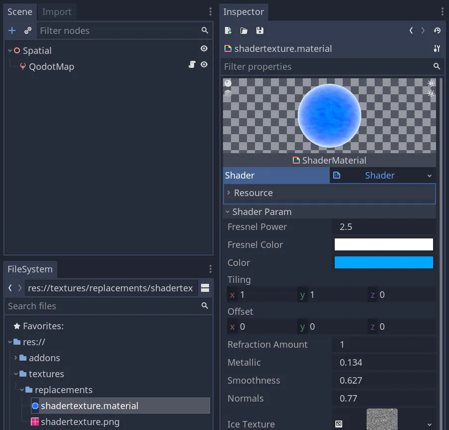
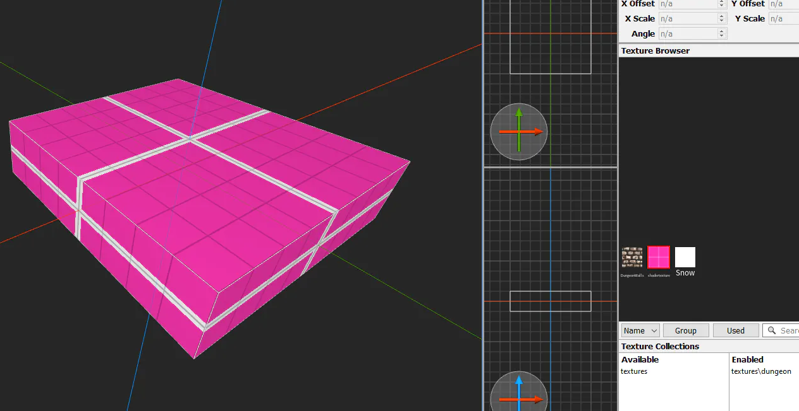
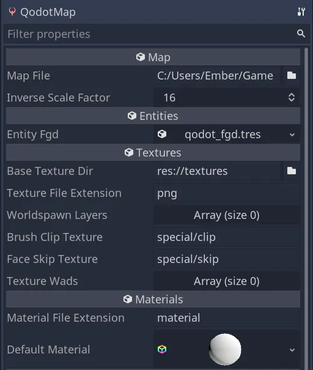
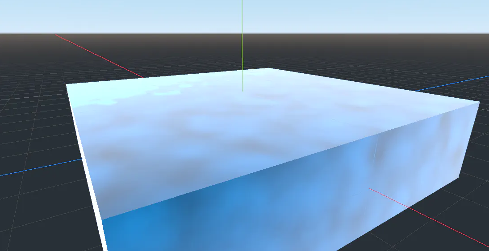

# Materials

Godot has several options for displaying PBR materials and shaders in 3D. You can use three of Qodot's material pipelines to convert textures on your map to materials in Godot. These are:
- Basic Texturing
- Material Override
- Automatic PBR Texturing

The rest of this guide will be looking through these three options, and how you can setup your Godot project to automatically apply PBR materials and shaders to surfaces.

1. TOC
{:toc}

## Prerequisites

For loose textures, you should have your own texture files to apply to surfaces. If you installed the entire plugin, you are free to copy the textures in `res://addons/qodot/textures` to your own project directory, into a folder like `res://textures`.

Differences in 1.7.0
{: .label .label-blue }
You can only use one texture file extension per QodotMap.

Differences in 1.7.1
{: .label .label-blue }
You can use an array of texture extensions per QodotMap. Consider updating the plugin if you are struggling to load textures from multiple file extensions.

Warning
{: .label .label-red }
Qodot can't read textures with spaces in the filename, or its parent folders. Check that your textures fit this naming scheme before continuing.

# Comparison of Texturing Methods

Here is a table showing a quick overview of the benefits some methods have over others.

Benefit | Basic Texturing | Material Override | Auto PBR Texturing
------- | --------------- | ----------------- | ------------------
Use textures between Trenchbroom and Qodot | ✅ | ✅ | ✅
Name materials freely | ✅ | ✅ |   
Flexible folder structure | ✅ | ✅ |   
Keep material tweaks on map rebuild |   | ✅ |   
Uses GLSL shaders |   | ✅ |   
Uses PBR Maps |   | ✅ | ✅
Builds Godot PBR materials for you |   |   | ✅

Material Override applies a .material or .tres of the same name as your texture file, letting you use ShaderMaterials and customized SpatialMaterials instead of flat textures.

Automatic PBR Texturing tells Qodot to create SpatialMaterials for you when building, provided you have named all texture files to follow the Qodot PBR naming format.

## Basic Texturing

Basic texturing applies an image to the brushes in your map. You can still control if filtering and other import effects are used by double-clicking the texture and changing the settings in the Import dock.

Read [Connecting your project to Trenchbroom](../Beginner's-Guide-to-Qodot#connecting-your-project-to-trenchbroom) to learn how to get textures applied to your map.

## Material Override

When you name a texture panel.png, Qodot interprets it as a new material called panel. In Basic Texturing, you’re creating a SpatialMaterial with the Albedo set to panel.png.

If you name a texture and a .material or .tres file the same name (not including the extension) you can **override** any instances of panel.png on a Trenchbroom brush with a panel.material in Godot.

In this example, I’m using an ice shader written in GLSL, originally from: [https://godotshaders.com/shader/spatial-ice-shader/](https://godotshaders.com/shader/spatial-ice-shader/)



Both the image and the .material share the same name. If we go to Trenchbroom, we’ll put the texture on brushes:



Then we double-check the file extensions we’re using on the QodotMap node are png and material (or tres if that’s what you prefer to use)

1.7.0:



1.7.1 downloaded from [https://github.com/Shfty/qodot-plugin/](https://github.com/Shfty/qodot-plugin/):


Building our map should show the ice shader in place of the texture with the same name.



If this didn’t work, and you followed all instructions, try changing the material to another valid texture in Trenchbroom, save the map, rebuild in Qodot, go back to Trenchbroom, reapply the shader material, then rebuild in Qodot again. That for some reason fixed it for me.

To learn even more about working with materials, read the [Qodot Wiki page on Textures and Materials.](https://github.com/Shfty/qodot-plugin/wiki/3.-Textures-and-Materials)

## Automatic PBR Texturing

You can use Automatic PBR Texturing to let Qodot do the hard work of assembling a SpatialMaterial for you, so long as you give it PBR maps and name them appropriately. 

**This method doesn’t let you tweak the materials after without undoing your work every build**. It's intended more-or-less to mass-import PBR materials onto a map. If you want more control, use **Material Override** instead.

To setup Automatic PBR Texturing

1.  Create a texture inside a subfolder: textures/group_name/texture_name.png
2.  Create a subfolder in the same directory with the texture’s name: textures/group_name/texture_name/
3.  Add textures to the subfolder that use the suffixes set in Project Settings -> Qodot -> Textures.

By default, Qodot has these suffixes set up to automatically build PBR textures:

- _normal.
- _metallic.
- _depth.
- _roughness.
- _ao.
- _emission.

Your texture name should come before the underscore, and your file extension should come after the dot. An example for a normal map in a PBR material would be `texture_name_normal.png` Any Godot-readible file extension will work.

The raw `texture_name.png` is always used as an editor texture *and* an Albedo texture.

If this pattern doesn't work for your material piplines, you can change the pattern of the filenames in Project Settings -> Qodot -> Textures.


Here's an example of a vines texture set up to work with auto pbr:

```
res://
	/textures
		/foliage
			/vines
				vines_normal.png
				vines_displacement.png
				vines_roughness.png
				vines_ao.png
			vines.png
```

When applying an Auto PBR material in Trenchbroom, you do not have to include any of the PBR maps with suffixes. Just the texture without any suffixes is required.

**Tip:** Since you can separate albedo from editor textures, it may help to add a grid or other distinguishing features of the material as a part of its editor texture, to aid in aligning the texture to neighbouring brushes.

## Default Material
For less control, but quicker setup, you can apply a default material to every single brush face in the map using the Default Material property in a QodotMap. This can be useful if you’re using Qodot to import models and you don’t want to setup textures or materials using any of the above methods.


# WAD File Support

Qodot adds palette.lmp and texture WAD import support to the Godot editor, allowing textures to be extracted and converted to RGB for in-engine use.

`.lmp` and `.wad` files will be automatically imported upon adding them to a project, and their contents can be viewed directly by double-clicking on their resources in the FileSystem tab:


To use a set of WAD files with QodotMap, add them to the Texture Wads property in the Inspector:


The texture loader will scan each WAD for textures present in the map and load them as appropriate.

**Note:** As the palette.lmp file from Quake was released into the public domain, it's included with Qodot to simplify the import of common texture WADs.
